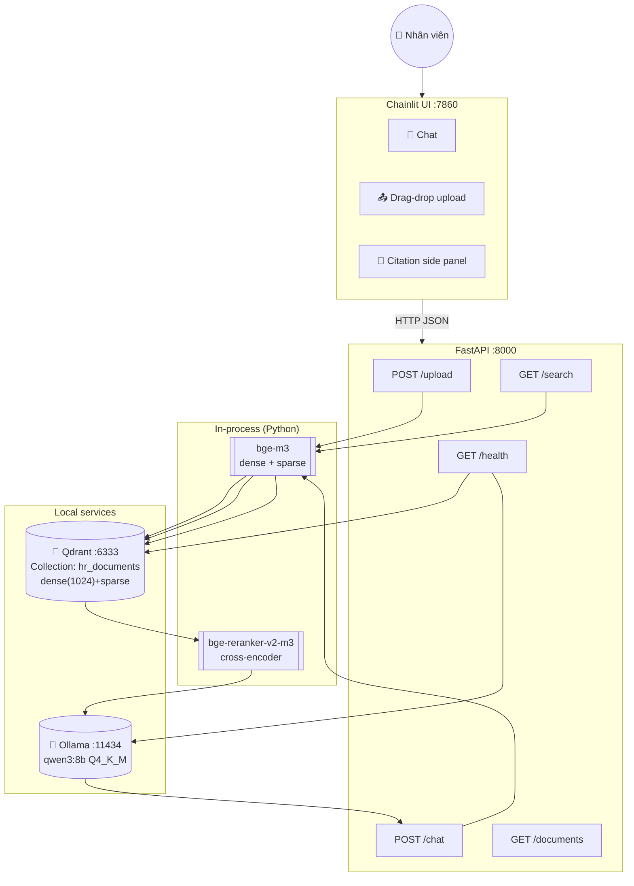
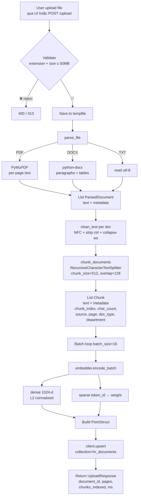
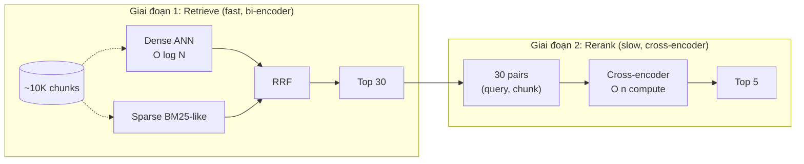
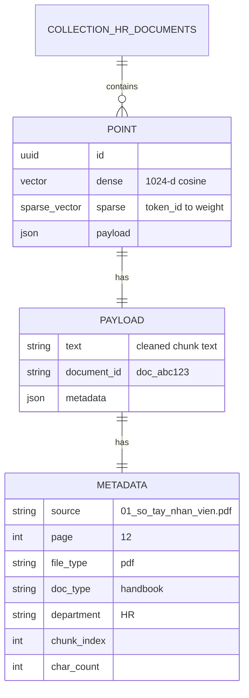
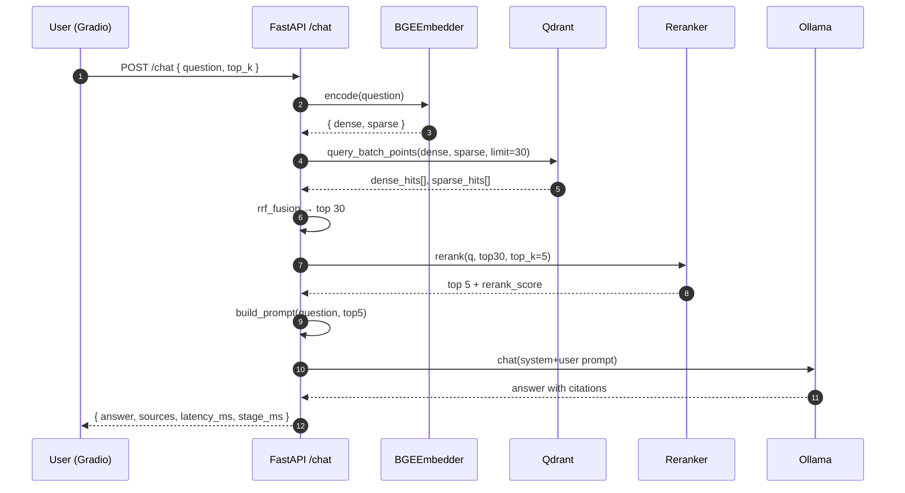
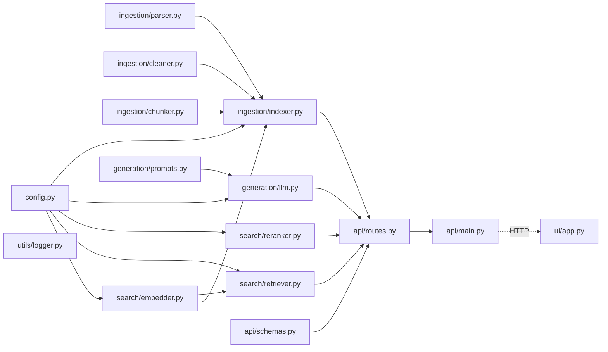
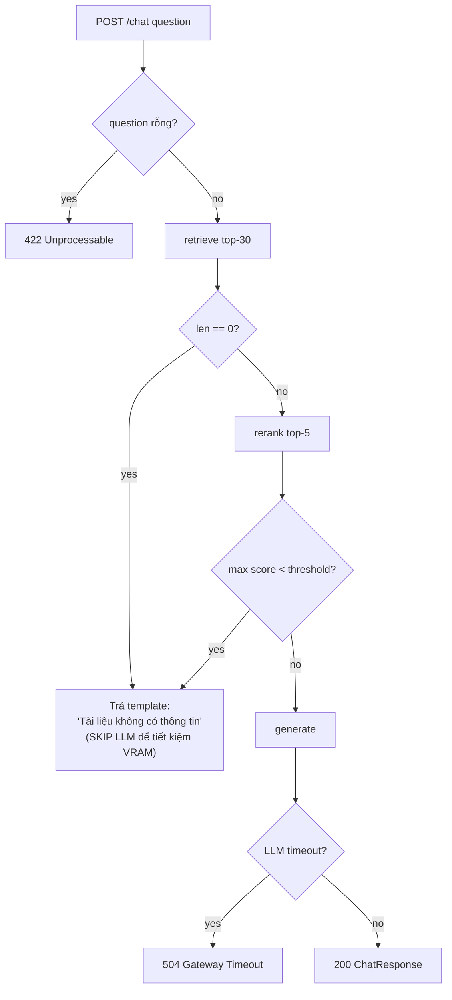

# PIPELINE — HR Document Search

Tài liệu này mô tả **chi tiết lưu đồ xử lý** của hệ thống RAG cho tài liệu nhân sự.
Tất cả các sơ đồ đều dùng [Mermaid](https://mermaid.js.org/) — GitHub / VS Code preview render trực tiếp.

---

## 1. Kiến trúc tổng quan



---

## 2. Luồng Ingestion (POST /upload)

Mục tiêu: biến 1 file tài liệu (PDF/DOCX/TXT) thành nhiều `PointStruct` trong Qdrant.



**Ví dụ dữ liệu qua từng bước**:

| Bước | Input | Output |
|------|-------|--------|
| parse | `so_tay_nhan_vien.pdf` (50 trang) | 50 `ParsedDocument` |
| clean | 50 doc có lẫn `\x00`, NFD | 50 doc sạch, NFC |
| chunk | 50 doc × ~2000 chars | ~142 `Chunk` (~512 chars, overlap 128) |
| embed | 142 chunk | `dense: (142, 1024)` + `sparse: List[dict]` |
| upsert | 142 point | 1 Qdrant collection +142 points |

---

## 3. Luồng Search + Generation (POST /chat)

```mermaid
flowchart TD
    Q["Câu hỏi tiếng Việt<br/>ví dụ: 'Nghỉ phép bao nhiêu ngày?'"] --> E1[bge-m3 encode query]
    E1 --> E1a[q_dense 1024-d]
    E1 --> E1b[q_sparse]

    E1a --> S[Qdrant query_batch_points]
    E1b --> S
    S --> S1[dense.search top-30]
    S --> S2[sparse.search top-30]

    S1 --> RRF["RRF fusion<br/>score = Σ 1/(k+rank+1)<br/>k=60"]
    S2 --> RRF
    RRF --> R30[Top 30 fused chunks<br/>{id, score, text, metadata}]

    R30 --> RR[bge-reranker-v2-m3<br/>cross-encoder score pairs]
    RR --> R5[Top 5 chunks<br/>+ rerank_score]

    R5 --> P[build_prompt<br/>system + context + question]
    P --> LLM[Ollama qwen3:8b<br/>temperature=0.2<br/>top_p=0.9]
    LLM --> ANS[Answer với citation<br/>Sổ tay NV, Trang 12]

    ANS --> RESP["ChatResponse<br/>{answer, sources[], latency_ms, stage_ms}"]
```

**Giải thích 2 giai đoạn tìm kiếm**:



Lý do pipeline **hình phễu**:
- Stage 1 nhanh nhưng encode query và doc độc lập → chỉ bắt được semantic thô.
- Stage 2 chậm hơn ~10× nhưng đọc query + chunk đồng thời → bắt được quan hệ tinh tế.
- Kết hợp lại: cân bằng tốc độ & độ chính xác.

---

## 4. Cấu trúc dữ liệu trong Qdrant



**Ví dụ 1 point**:

```json
{
  "id": "a1b2c3d4-...",
  "vector": {
    "dense": [0.021, -0.113, ..., 0.087],
    "sparse": { "12345": 0.87, "67890": 0.42 }
  },
  "payload": {
    "text": "Điều 5. Chế độ nghỉ phép. 5.1. Nghỉ phép năm: Nhân viên...",
    "document_id": "doc_a1b2c3",
    "metadata": {
      "source": "01_so_tay_nhan_vien_2024.pdf",
      "page": 12,
      "file_type": "pdf",
      "doc_type": "handbook",
      "department": "HR",
      "chunk_index": 3,
      "char_count": 487
    }
  }
}
```

---

## 5. Sequence diagram — /chat end-to-end



---

## 6. Thứ tự module (dependency graph)



---

## 7. VRAM timeline (ví dụ 1 request /chat)

```mermaid
gantt
    title VRAM allocation during /chat (RTX 5060 8GB)
    dateFormat X
    axisFormat %s ms

    section bge-m3
    Loaded (1.2GB always)   :done, 0, 5000

    section bge-reranker
    Lazy load (1.2GB)       :active, 100, 500
    Stay in VRAM            :active, 600, 2000
    Idle unload optional    :crit, 2600, 2700

    section Qwen3-8B (Ollama)
    Already loaded (5.5GB)  :done, 0, 5000
    KV cache (+1GB)         :active, 800, 2000

    section Peak
    Peak ≈ 7.0 GB           :milestone, 1000, 0
```



---

## 8. Error & edge-case handling



---

## 9. So sánh latency từng stage (kỳ vọng)

| Stage | Thời gian | Ghi chú |
|-------|-----------|---------|
| Embed query | ~40 ms | bge-m3, GPU |
| Hybrid search | ~100 ms | Qdrant `query_batch_points` |
| Rerank top-30 → top-5 | ~350 ms | cross-encoder, GPU |
| LLM generate (~150 tokens) | ~700 ms | Qwen3-8B Q4_K_M trên RTX 5060 |
| **Tổng** | **~1.2 s** | Mục tiêu NFR-1: < 5s |

---

## 10. Tài liệu liên quan

- [PROJECT_PLAN.md](PROJECT_PLAN.md) — kế hoạch chi tiết đầy đủ
- [README.md](README.md) — setup & usage
- Source code: `src/ingestion`, `src/search`, `src/generation`, `src/api`
