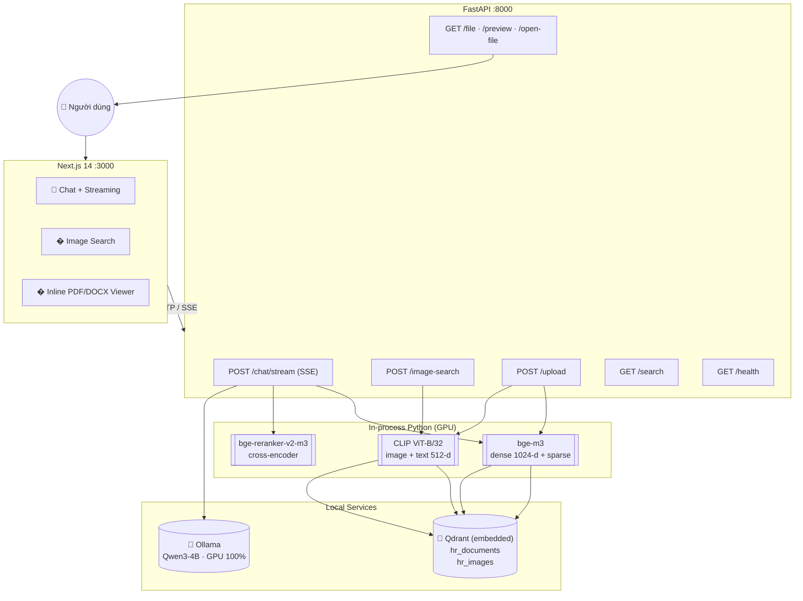
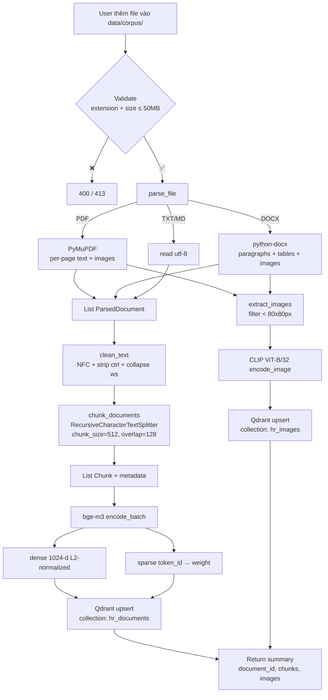
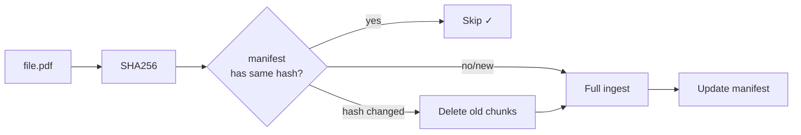
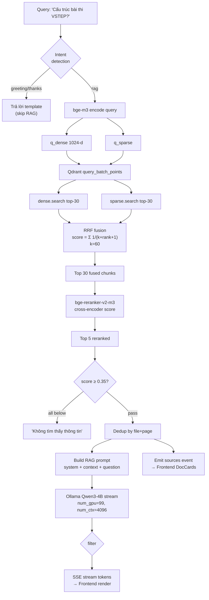
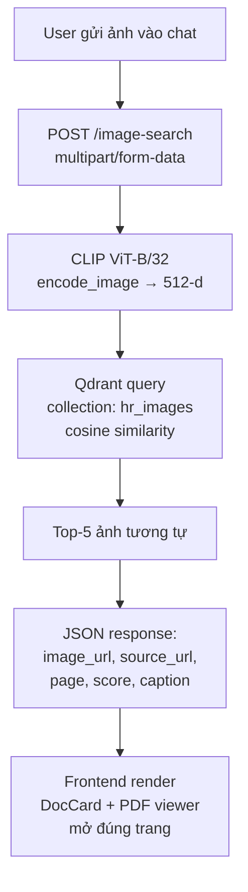
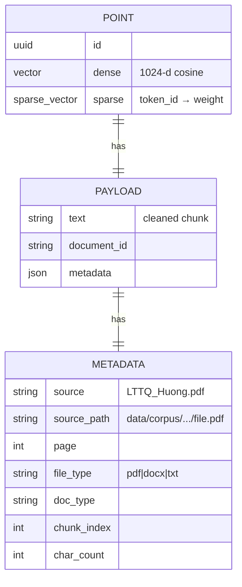
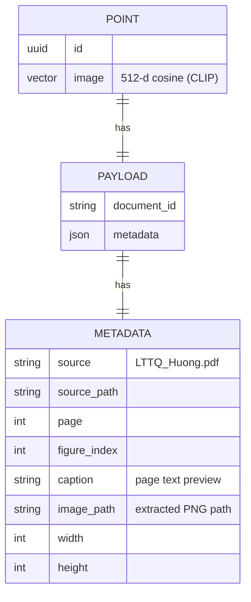
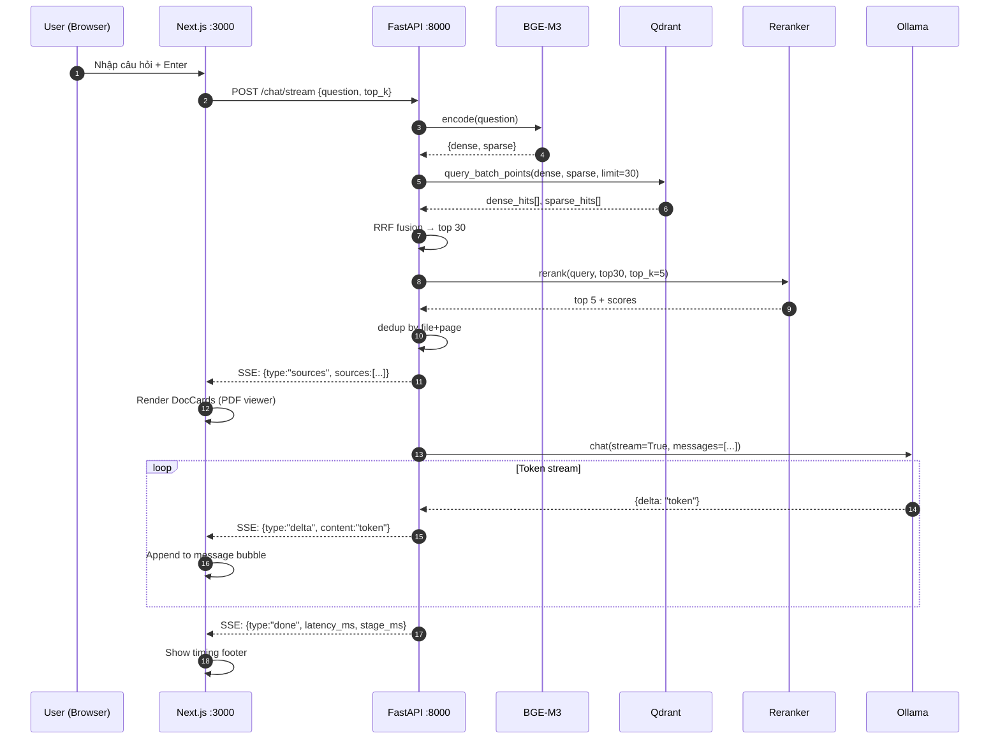
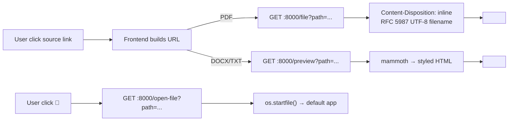

# PIPELINE — Document Search Assistant

Tài liệu mô tả **chi tiết lưu đồ xử lý** của hệ thống RAG tìm kiếm tài liệu.
Sơ đồ dùng [Mermaid](https://mermaid.js.org/) — GitHub / VS Code preview render trực tiếp.

---

## 1. Kiến trúc tổng quan



---

## 2. Luồng Ingestion (POST /upload hoặc scripts/ingest_folder.py)



### Incremental Ingest (Manifest)



---

## 3. Luồng Search + Generation (POST /chat/stream)



---

## 4. Luồng Image Search (POST /image-search)



---

## 5. Cấu trúc dữ liệu trong Qdrant

### Collection: hr_documents



### Collection: hr_images



---

## 6. Sequence Diagram — /chat/stream end-to-end



---

## 7. VRAM Budget (RTX 5060, 8GB)

```
┌────────────────────────────────────┬──────────┐
│ Component                          │ VRAM     │
├────────────────────────────────────┼──────────┤
│ bge-m3 (always loaded)             │ ~1.2 GB  │
│ bge-reranker-v2-m3 (lazy load)     │ ~1.2 GB  │
│ Qwen3-4B Q4_K_M (Ollama, 100%)    │ ~3.5 GB  │
│ KV cache (4K context)              │ ~0.5 GB  │
│ CLIP ViT-B/32 (on-demand)          │ ~0.6 GB  │
│ PyTorch/CUDA overhead              │ ~0.5 GB  │
├────────────────────────────────────┼──────────┤
│ Peak (all loaded)                  │ ~7.5 GB  │
│ Available                          │ 8.0 GB   │
│ Margin                             │ 0.5 GB   │
└────────────────────────────────────┴──────────┘
```

---

## 8. File Serving Flow



---

## 9. Frontend Component Tree

```
app/page.tsx (ChatPage)
├── components/header.tsx         — Logo + subtitle
├── components/welcome.tsx        — 4 example prompts
├── components/message-bubble.tsx — User/Assistant messages
│   ├── components/doc-card.tsx   — PDF/DOCX inline viewer
│   │   ├── iframe (PDF or HTML preview)
│   │   ├── Loading spinner
│   │   └── Buttons: ↗ new tab · 📂 open local · ✕ close
│   └── components/typing-indicator.tsx — Bouncing dots
├── components/chat-input.tsx     — Textarea + image attach
│   ├── Image preview chip
│   ├── 📷 attach button
│   └── ↑ send / ■ stop buttons
└── lib/
    ├── chat-client.ts            — SSE parser + console logs
    ├── types.ts                  — ChatMessage, Source, SSEEvent
    └── utils.ts                  — cn(), formatMs()
```

---

## 10. Latency Breakdown (kỳ vọng sau GPU fix)

| Stage | Thời gian | Ghi chú |
|-------|-----------|---------|
| Embed query | ~50 ms | bge-m3, GPU |
| Hybrid search | 200-800 ms | Qdrant embedded |
| Rerank top-30 → top-5 | 150-300 ms | cross-encoder, GPU |
| LLM generate (~150 tokens) | 3-8 s | Qwen3-4B, 100% GPU |
| Image search (CLIP) | 30-100 ms | after first load |
| **Total text query** | **4-10 s** | |
| **Total image query** | **1-6 s** | |

---

## 11. Tài liệu liên quan

- [README.md](README.md) — setup & usage
- [PROJECT_PLAN.md](PROJECT_PLAN.md) — kế hoạch gốc
- [web/README.md](web/README.md) — frontend architecture
- [report/](report/) — báo cáo Word
- Source: `src/ingestion`, `src/search`, `src/generation`, `src/api`
